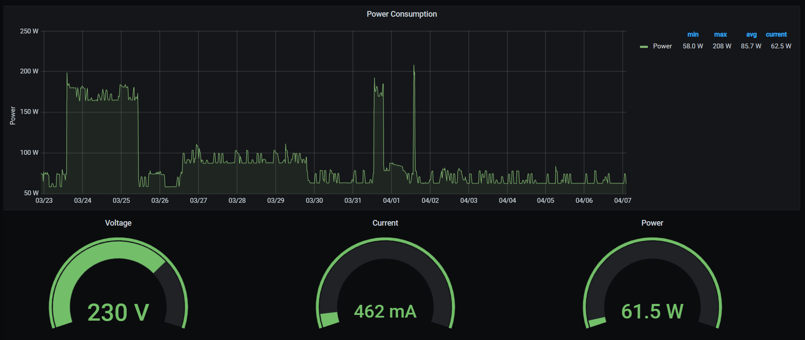

# HS110 Energy Monitor - InfluxDB Exporter
[](https://github.com/WouterStemgee/tplink-hs110-energy-data-exporter/actions/workflows/CI.yml)
[](https://hub.docker.com/repository/docker/wouterstemgee/hs110influx)
[](LICENSE)

A [TP-Link HS110 smart plug](https://www.tp-link.com/nl-be/home-networking/smart-plug/hs110/) data exporter for InfluxDB using the [tplink-smarthome-api](https://www.npmjs.com/package/tplink-smarthome-api).

## Usage: Docker
```bash
docker run \
  -e TIMER=1000 \                   # Interval between measurement points
  -e DEVICE_IP_ADDR=10.20.0.110 \   # Smart device IP address
  -e INFLUX_HOST=localhost \        # InfluxDB hostname
  -e INFLUX_DB=hs110_db \           # InfluxDB database name
  -e HOSTNAME=hs110 \               # Smart device name (can be anything) 
  -d wouterstemgee/hs110-influx
```

## Output
### [Grafana Visualization](dashboard/energy_usage.json)

### Data Format
Example `power_consumption` timeseries measurement point:
```json
{
  "voltage_mv": 230983,
  "current_ma": 426,
  "power_mw": 59497,
  "total_wh": 30964,
}
```
